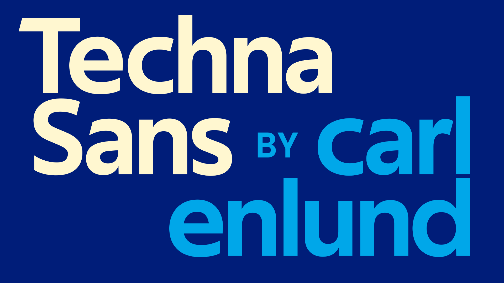
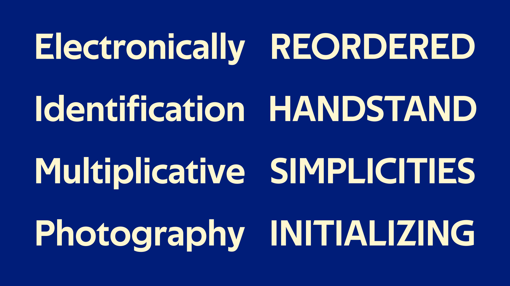
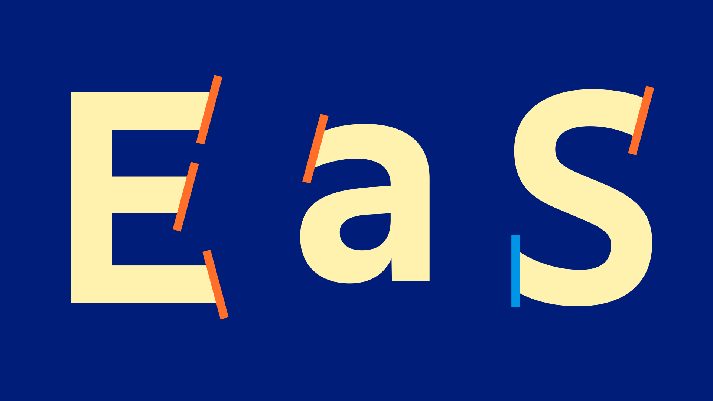

# Techna Sans

Techna Sans is a bold, geometric sans-serif typeface.
The typeface is tightly spaced, intended mainly for display use.
But with generous spacing it works equally well in smaller sizes.

**[↓ Download Techna Sans](https://github.com/carlenlund/techna-sans/releases/download/v1.000/techna-sans.zip)**

## OpenType features

An alternate, single-storey a is available via Stylistic Set 1.
Stylistic sets are enabled differently depending on the application used.
If you are using CSS, Stylistic Set 1 can enabled with `font-feature-settings: 'ss01';`.

## Language support

Techna Sans has over 300 glyphs and supports the [Adobe Latin 3 character set](https://adobe-type-tools.github.io/adobe-latin-charsets/adobe-latin-3.html).

Currently supported languages: Afrikaans, Albanian, Basque, Bosnian, Catalan, Croatian, Czech, Danish, Dutch, English, Estonian, Faroese, Filipino, Finnish, French, Galician, German, Hungarian, Icelandic, Indonesian, Irish, Italian, Latvian, Lithuanian, Malay, Norwegian Bokmål, Polish, Portuguese, Romanian, Slovak, Slovenian, Spanish, Swahili, Swedish, Turkish and Zulu.
