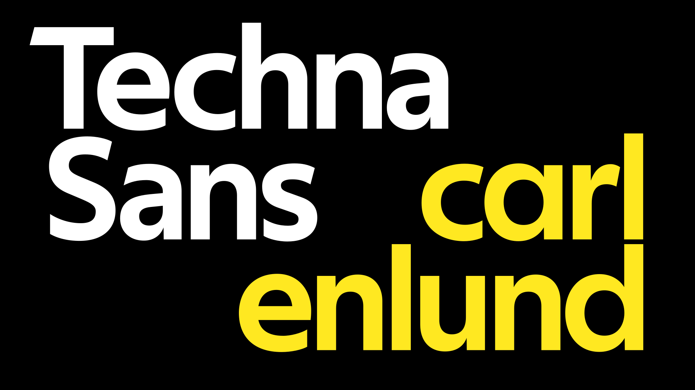
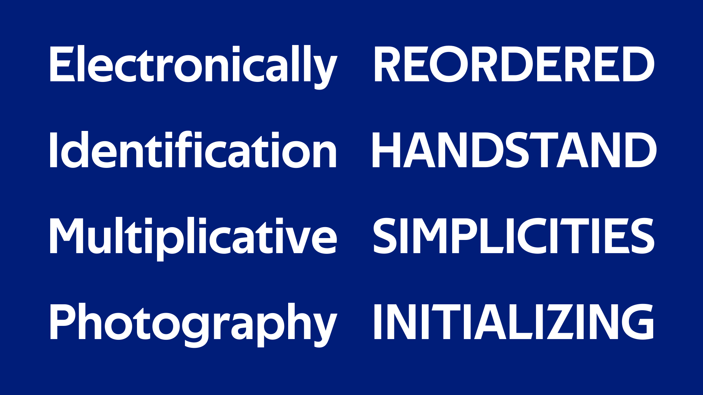
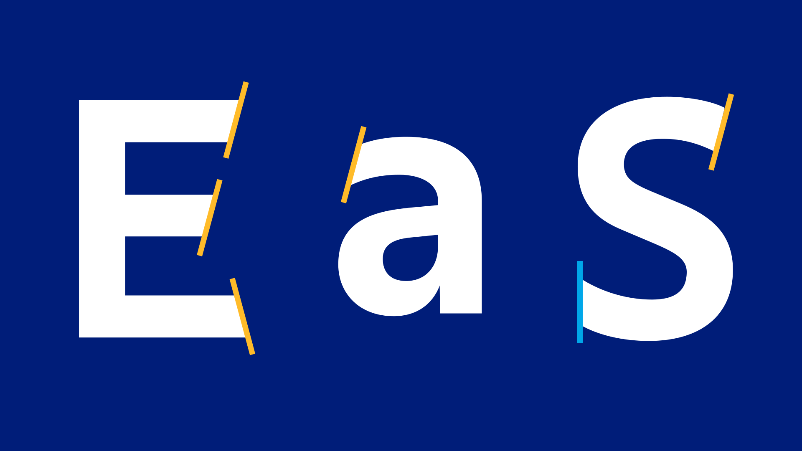
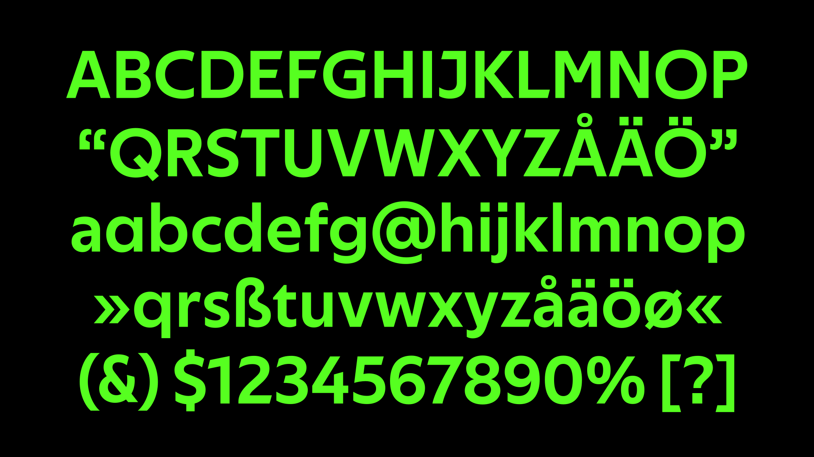

# Techna Sans

Techna Sans is a bold, geometric sans-serif typeface.
Its sharp stroke endings, following strict geometric angles, give the typeface an authentic and modern look,
making it perfect for branding and headlines.
The typeface is tightly spaced, intended mainly for display use,
but with generous spacing it works equally well in smaller sizes.

The typeface is licensed under the SIL Open Font License, making it for free both for personal and commercial use.

**[↓ Download Techna Sans](https://github.com/carlenlund/techna-sans/releases/download/v1.000/techna-sans.zip)**

## OpenType features

An alternate, single-storey **a** is available via Stylistic Set 1.
If you are using CSS, the stylistic set can enabled with the property `font-feature-settings: 'ss01'`.
For other applications, e.g. Adobe InDesign, a quick Google search might be needed.

The typeface also has a set of proportional figures, available via `pnum`.
By default tabular figures are enabled, meaning that all numbers have the same width.
Proportional figures can be enabled in CSS with `font-variant-numeric: proportional-nums` (or alternatively `font-feature-settings: 'pnum'`).

## Language support

Techna Sans has over 350 glyphs and supports the [Adobe Latin 3 character set](https://adobe-type-tools.github.io/adobe-latin-charsets/adobe-latin-3.html).

Supported languages: Afrikaans, Albanian, Basque, Bosnian, Catalan, Croatian, Czech, Danish, Dutch, English, Estonian, Faroese, Filipino, Finnish, French, Galician, German, Hungarian, Icelandic, Indonesian, Irish, Italian, Latvian, Lithuanian, Malay, Norwegian Bokmål, Polish, Portuguese, Romanian, Slovak, Slovenian, Spanish, Swahili, Swedish, Turkish and Zulu.
